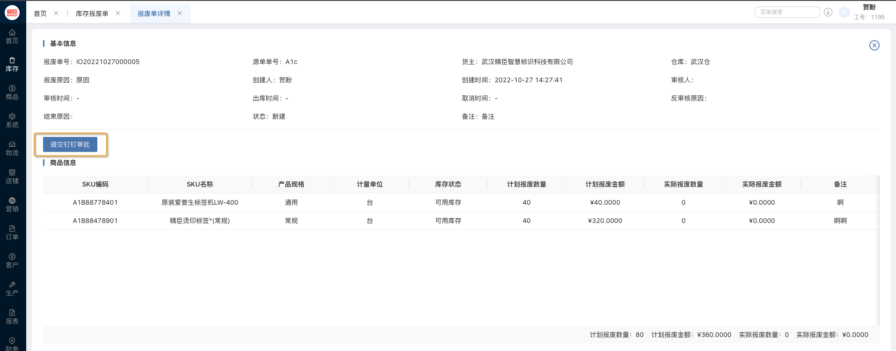
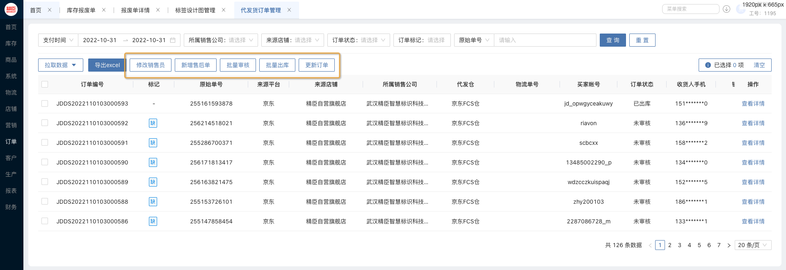

###### 2022 年 11 月 01 日 UOS V1.15.1 上线！

【库存报废单】

- 报废单支持钉钉审核
<div align="center">   
      
</div>
- 报废单支持反审核
- 支持手动同步
- 报废单报废后支持中途结束报废
- 支持手动多次报废
- 支持批量多库存类型多商品同时报废

【代发货订单优化】

- 支持批量修改销售员
<div align="center">   
      
</div>
- 支持跳转新增售后单
- 支持批量审核
- 支持批量出库
- 支持批量更新

👍 👎

# 标题一<!-- {docsify-ignore-all} -->

## 标题二

### 标题三

#### 标题四

##### 标题五

###### 标题六

**粗体**

_斜体_

~~删除线~~

[链接文本](https://www.niimbot.com)

- 无序列表 1
- 无序列表 2
- 无序列表 3

1. 有序列表 1
2. 有序列表 2
3. 有序列表 3
4.

- [ ] 任务列表 1
- [ ] 任务列表 2

> 引用文本 1111

---

```json
{
    "path": "/user/login",
    "name": "login",
    "component": "./User/Login"
},
```

行内代码 `const a = b + c`

| col1 | col2 | col3 |
| ---- | ---- | ---- |
| 1    | 1    | 1    |
| 2    | 2    | 2    |

